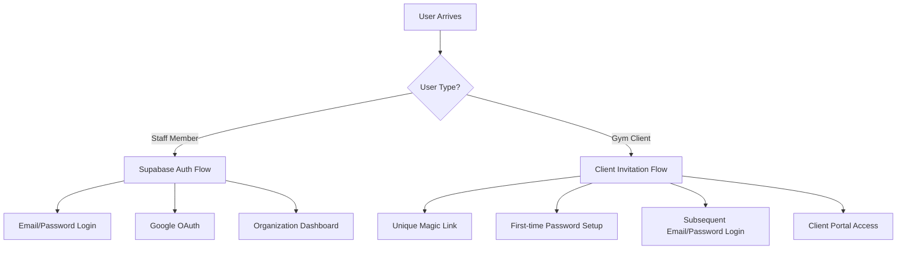

# Authentication System Documentation

**Updated**: 2025-01-29T10:00:00Z
**System**: Atlas Fitness CRM - GoTeamUp-Style Authentication

## Overview

Atlas Fitness CRM implements a dual authentication system that serves both organization staff and gym clients with different authentication flows optimized for their respective use cases.

## Authentication Architecture

### Two-Tier Authentication Model

1. **Staff Authentication**: Traditional Supabase Auth for organization members
2. **Client Authentication**: GoTeamUp-style invitation system with password management



## Staff Authentication System

### Implementation

- **Provider**: Supabase Auth
- **Methods**: Email/password, Google OAuth
- **Session Management**: JWT tokens with refresh rotation
- **Multi-tenancy**: Organization ID resolved from user context

### Flow

1. Staff member signs up → Organization created automatically
2. Subsequent logins → Organization context loaded from `auth_users` table
3. All operations scoped to organization via RLS policies

### Code Example

```typescript
// Staff authentication middleware
export async function requireStaffAuth(): Promise<StaffAuthContext> {
  const {
    data: { user },
  } = await supabase.auth.getUser();

  if (!user) throw new UnauthorizedError("Staff auth required");

  const { data: authUser } = await supabase
    .from("auth_users")
    .select("*, organization:organizations(*)")
    .eq("auth_id", user.id)
    .single();

  return {
    userId: authUser.id,
    organizationId: authUser.organization_id,
    role: authUser.role,
  };
}
```

## Client Authentication System (GoTeamUp-Style)

### Core Principles

1. **Unique Non-Expiring Links**: Each client gets a permanent, unique invitation link
2. **One-Time Password Setup**: Password is set only during first claim
3. **Subsequent Simple Login**: Email + password for all future access
4. **No Account Creation Friction**: Clients don't "sign up" - they're invited

### Database Schema

#### client_invitations Table

```sql
CREATE TABLE client_invitations (
  id UUID DEFAULT uuid_generate_v4() PRIMARY KEY,
  organization_id UUID NOT NULL REFERENCES organizations(id),
  email TEXT NOT NULL,
  invitation_token TEXT UNIQUE NOT NULL, -- 64-char hex string
  is_claimed BOOLEAN DEFAULT false,
  claimed_at TIMESTAMP WITH TIME ZONE,
  invited_by UUID REFERENCES auth_users(id),
  created_at TIMESTAMP WITH TIME ZONE DEFAULT NOW()
);
```

#### clients Table (Updated)

```sql
CREATE TABLE clients (
  id UUID DEFAULT uuid_generate_v4() PRIMARY KEY,
  organization_id UUID NOT NULL REFERENCES organizations(id),
  email TEXT UNIQUE NOT NULL,
  password_hash TEXT, -- bcrypt hash
  password_set_at TIMESTAMP WITH TIME ZONE,
  last_login_at TIMESTAMP WITH TIME ZONE,
  invitation_id UUID REFERENCES client_invitations(id),
  is_active BOOLEAN DEFAULT true,
  -- ... other profile fields
);
```

### Authentication Flow

#### Step 1: Client Invitation Creation

```typescript
// POST /api/client-invitations
export async function createInvitation(data: {
  email: string;
  firstName?: string;
  lastName?: string;
  organizationId: string;
}) {
  const invitationToken = crypto.randomBytes(32).toString("hex");

  const invitation = await supabase
    .from("client_invitations")
    .insert({
      organization_id: data.organizationId,
      email: data.email,
      invitation_token: invitationToken,
    })
    .select()
    .single();

  // Send email with unique link
  await sendInvitationEmail({
    email: data.email,
    invitationUrl: `${process.env.APP_URL}/claim/${invitationToken}`,
  });

  return invitation;
}
```

#### Step 2: Client Claims Invitation

```typescript
// POST /api/auth/claim
export async function claimInvitation(data: {
  token: string;
  password: string;
  firstName?: string;
  lastName?: string;
}) {
  // Validate token
  const invitation = await supabase
    .from("client_invitations")
    .select()
    .eq("invitation_token", data.token)
    .eq("is_claimed", false)
    .single();

  if (!invitation) {
    throw new BadRequestError("Invalid or already claimed invitation");
  }

  // Hash password
  const passwordHash = await bcrypt.hash(data.password, 12);

  // Create client record
  const client = await supabase
    .from("clients")
    .insert({
      organization_id: invitation.organization_id,
      email: invitation.email,
      password_hash: passwordHash,
      password_set_at: new Date(),
      invitation_id: invitation.id,
      first_name: data.firstName,
      last_name: data.lastName,
    })
    .select()
    .single();

  // Mark invitation as claimed
  await supabase
    .from("client_invitations")
    .update({
      is_claimed: true,
      claimed_at: new Date(),
    })
    .eq("id", invitation.id);

  // Generate client JWT
  const token = jwt.sign(
    {
      clientId: client.id,
      organizationId: client.organization_id,
      email: client.email,
      type: "client",
    },
    process.env.JWT_SECRET!,
    { expiresIn: "7d" },
  );

  return { client, token };
}
```

#### Step 3: Subsequent Client Login

```typescript
// POST /api/auth/simple-login
export async function clientLogin(data: {
  email: string;
  password: string;
  organizationId: string;
}) {
  // Find client
  const client = await supabase
    .from("clients")
    .select()
    .eq("email", data.email)
    .eq("organization_id", data.organizationId)
    .eq("is_active", true)
    .single();

  if (!client) {
    throw new UnauthorizedError("Invalid credentials");
  }

  // Verify password
  const isValidPassword = await bcrypt.compare(
    data.password,
    client.password_hash,
  );

  if (!isValidPassword) {
    throw new UnauthorizedError("Invalid credentials");
  }

  // Update last login
  await supabase
    .from("clients")
    .update({ last_login_at: new Date() })
    .eq("id", client.id);

  // Generate JWT
  const token = jwt.sign(
    {
      clientId: client.id,
      organizationId: client.organization_id,
      email: client.email,
      type: "client",
    },
    process.env.JWT_SECRET!,
    { expiresIn: "7d" },
  );

  return { client, token };
}
```

## Security Considerations

### Password Security

- **Hashing**: bcrypt with 12 salt rounds
- **Strength Requirements**: 8+ chars, mixed case, numbers
- **Storage**: Never store plaintext passwords
- **Reset**: Temporary tokens for password resets

### Token Management

- **Invitation Tokens**: 32-byte random hex (256-bit entropy)
- **JWT Tokens**: 7-day expiry with refresh capability
- **Client Context**: Organization ID embedded in JWT claims
- **Validation**: All tokens validated on every request

### Rate Limiting

```typescript
// Apply to auth endpoints
const rateLimiter = rateLimit({
  windowMs: 15 * 60 * 1000, // 15 minutes
  max: 5, // limit each IP to 5 requests per windowMs
  message: "Too many authentication attempts",
  standardHeaders: true,
  legacyHeaders: false,
});
```

### Row Level Security

```sql
-- Clients can only access their own data
CREATE POLICY "Clients can view own record" ON clients
  FOR SELECT
  USING (
    email = current_setting('jwt.claims.email', true)
    AND organization_id = current_setting('jwt.claims.organization_id', true)::UUID
  );

-- Staff can manage all clients in their organization
CREATE POLICY "Staff can manage clients" ON clients
  FOR ALL
  USING (
    organization_id IN (
      SELECT organization_id
      FROM auth_users
      WHERE auth_id = auth.uid()
    )
  );
```

## API Endpoints

### Client Authentication Endpoints

| Endpoint                                   | Method | Purpose                         | Auth Required |
| ------------------------------------------ | ------ | ------------------------------- | ------------- |
| `/api/client-invitations`                  | POST   | Create invitation               | Staff         |
| `/api/client-invitations/[token]/validate` | GET    | Validate token                  | None          |
| `/api/auth/claim`                          | POST   | Claim invitation & set password | Token         |
| `/api/auth/simple-login`                   | POST   | Email/password login            | None          |
| `/api/auth/client/logout`                  | POST   | Invalidate session              | Client        |
| `/api/auth/client/refresh`                 | POST   | Refresh JWT token               | Client        |

### Request/Response Formats

#### Create Invitation

```typescript
// POST /api/client-invitations
{
  email: "client@example.com",
  firstName?: "John",
  lastName?: "Doe",
  customMessage?: "Welcome to our gym!"
}

// Response
{
  success: true,
  data: {
    id: "uuid",
    invitation_token: "64-char-hex",
    email: "client@example.com",
    invitation_url: "https://app.com/claim/token"
  }
}
```

#### Claim Invitation

```typescript
// POST /api/auth/claim
{
  token: "invitation-token",
  password: "SecurePass123",
  confirmPassword: "SecurePass123"
}

// Response
{
  success: true,
  data: {
    client: { id: "uuid", email: "...", ... },
    token: "jwt-token",
    expiresAt: "2025-02-05T10:00:00Z"
  }
}
```

#### Simple Login

```typescript
// POST /api/auth/simple-login
{
  email: "client@example.com",
  password: "SecurePass123",
  organizationId: "org-uuid"
}

// Response
{
  success: true,
  data: {
    client: { id: "uuid", email: "...", ... },
    token: "jwt-token",
    expiresAt: "2025-02-05T10:00:00Z"
  }
}
```

## Email Templates

### Invitation Email

```html
<h1>Welcome to {{organizationName}}</h1>
<p>You've been invited to access your client portal.</p>
<p>Click the link below to set up your account:</p>
<a href="{{invitationUrl}}">Set Up My Account</a>
<p>This link is unique to you and will not expire.</p>
```

### Welcome Email (After Claiming)

```html
<h1>Account Setup Complete!</h1>
<p>Your account has been successfully created.</p>
<p>You can now log in anytime with:</p>
<ul>
  <li>Email: {{email}}</li>
  <li>Password: (the one you just created)</li>
</ul>
<a href="{{loginUrl}}">Access Your Portal</a>
```

## Error Handling

### Common Error Responses

```typescript
interface AuthError {
  code: string;
  message: string;
  details?: any;
}

// Invalid invitation token
{
  success: false,
  error: {
    code: 'INVALID_INVITATION',
    message: 'Invitation token is invalid or has been claimed'
  }
}

// Password too weak
{
  success: false,
  error: {
    code: 'WEAK_PASSWORD',
    message: 'Password does not meet strength requirements',
    details: {
      requirements: [
        'At least 8 characters',
        'At least one uppercase letter',
        'At least one number'
      ]
    }
  }
}
```

## Migration from OTP System

### Deprecated Endpoints

- ❌ `POST /api/login-otp` - Replaced by `/api/auth/claim` and `/api/auth/simple-login`
- ❌ `POST /api/login-otp/confirm` - No longer needed

### Migration Steps

1. Existing OTP users automatically get invitation records created
2. First login prompts for password setup
3. Subsequent logins use email/password
4. Old OTP tables can be safely dropped after migration

### Backward Compatibility

During transition period, both systems can coexist:

```typescript
// Check if client has password set
if (client.password_hash) {
  // Use new password login
  return await clientPasswordLogin(email, password);
} else {
  // Fall back to OTP system (temporary)
  return await legacyOTPLogin(email);
}
```

## Testing Strategy

### Unit Tests

- Password hashing/verification
- Token generation/validation
- Invitation creation logic
- JWT token claims

### Integration Tests

- Complete invitation flow
- Login after password setup
- Invalid token handling
- Rate limiting behavior

### E2E Tests

- Staff creates invitation
- Client receives email
- Client claims invitation
- Client logs in subsequently
- Client accesses protected resources

This authentication system provides a seamless experience for gym clients while maintaining security and proper multi-tenant isolation.
