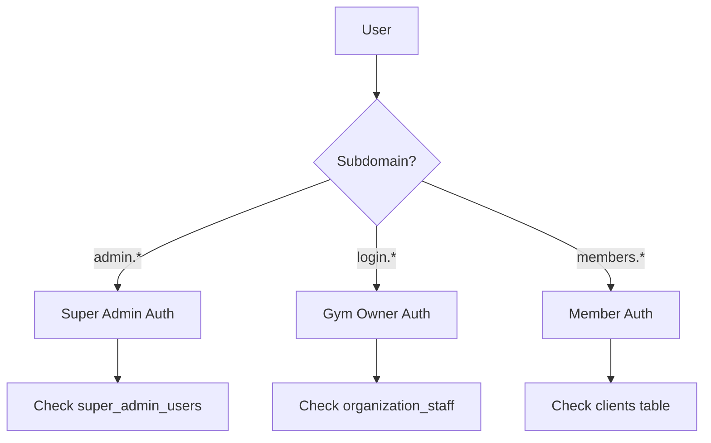

# Atlas Fitness Platform - Architecture Documentation

## Current Architecture Status

### Overview

Atlas Fitness is a multi-tenant SaaS platform for gym management with three distinct user tiers:

- **Super Admin** (admin.gymleadhub.co.uk) - Platform owner with full control
- **Gym Owners** (login.gymleadhub.co.uk) - Licensed gym operators using the CRM/booking system
- **Gym Members** (members.gymleadhub.co.uk) - End users booking classes and managing memberships

### Current Implementation

- **Single Repository**: All code in one Next.js application
- **Single Deployment**: One Vercel project serving all subdomains
- **Database**: Single Supabase instance with partial RLS implementation
- **Authentication**: Shared auth system with role-based routing via middleware

## Architecture Migration Plan

### Phase 1: Immediate Optimizations (Week 1-2) 🚨 CRITICAL

These fixes are required before onboarding any new gyms.

#### 1.1 Add Redis Caching Layer

- [ ] Install Redis/Upstash for caching and session management
- [ ] Implement tenant-aware cache keys: `org:{orgId}:resource:{resourceId}`
- [ ] Cache frequently accessed data (gym settings, membership plans, class schedules)
- [ ] Add cache invalidation on data mutations

#### 1.2 Fix Database Connection Pooling

- [ ] Configure Supabase connection pooling
- [ ] Implement connection limits per tenant
- [ ] Add query timeout configurations
- [ ] Monitor connection usage

#### 1.3 Complete RLS Implementation

- [ ] Audit all tables for missing RLS policies
- [ ] Ensure every table has `organization_id` column
- [ ] Implement consistent tenant isolation policies
- [ ] Remove post-fetch filtering in API routes

#### 1.4 Tenant-Aware Rate Limiting

- [ ] Implement Redis-based rate limiting
- [ ] Set limits per organization_id
- [ ] Different tiers for basic/premium/enterprise
- [ ] Add DDoS protection

### Phase 2: Repository Restructuring (Month 1)

#### 2.1 Monorepo Structure

```
atlas-fitness-platform/
├── apps/
│   ├── admin/          # Super admin portal
│   │   ├── app/
│   │   ├── components/
│   │   └── package.json
│   ├── dashboard/      # Gym owner portal
│   │   ├── app/
│   │   ├── components/
│   │   └── package.json
│   └── members/        # Member portal
│       ├── app/
│       ├── components/
│       └── package.json
├── packages/
│   ├── ui/            # Shared UI components
│   ├── database/      # Prisma schemas & types
│   ├── auth/          # Authentication logic
│   └── utils/         # Common utilities
├── infrastructure/
│   ├── vercel/        # Deployment configs
│   └── docker/        # Container configs
└── turbo.json         # Turborepo config
```

#### 2.2 Code Separation Strategy

- Extract shared components to packages
- Separate subdomain-specific logic
- Maintain single source of truth for data models
- Share authentication/authorization logic

### Phase 3: Multi-Zone Deployment (Month 2)

#### 3.1 Vercel Project Structure

```
vercel-projects/
├── atlas-admin/         # admin.gymleadhub.co.uk
├── atlas-dashboard/     # login.gymleadhub.co.uk
└── atlas-members/       # members.gymleadhub.co.uk
```

#### 3.2 Shared Infrastructure

- **Database**: Single Supabase with proper partitioning
- **Cache**: Shared Redis cluster
- **CDN**: Cloudflare with subdomain routing
- **Storage**: S3 with tenant prefixes

### Phase 4: Enterprise Features (Quarter 1)

#### 4.1 Database Partitioning

- Implement partition by `organization_id`
- Create indexes for common queries
- Add read replicas for scale
- Implement connection routing

#### 4.2 Background Jobs

- Add BullMQ for job processing
- Separate queues per tenant
- Priority queues for enterprise
- Job monitoring dashboard

#### 4.3 White-Label Support

- Custom domain mapping
- Theme customization per org
- Branded email templates
- Custom SSO integration

## Security Architecture

### Authentication Flow



### Data Isolation Model

```sql
-- Every table must have organization_id
ALTER TABLE {table_name} ADD COLUMN organization_id UUID;

-- RLS policy template
CREATE POLICY tenant_isolation ON {table_name}
FOR ALL USING (
  organization_id = current_setting('app.current_org')::uuid
);
```

### API Security Layers

1. **Subdomain validation** - Middleware checks
2. **Authentication** - Supabase JWT validation
3. **Authorization** - Role-based access control
4. **Tenant isolation** - Organization-level filtering
5. **Rate limiting** - Per-tenant quotas

## Performance Targets

### Scalability Metrics

- **Target**: Support 100+ gyms concurrently
- **Response time**: < 200ms p95
- **Availability**: 99.9% uptime
- **Data isolation**: Zero cross-tenant leaks

### Resource Limits per Tenant

```javascript
const TENANT_LIMITS = {
  basic: {
    api_calls_per_minute: 60,
    storage_gb: 5,
    monthly_active_members: 500,
    concurrent_bookings: 10,
  },
  premium: {
    api_calls_per_minute: 300,
    storage_gb: 25,
    monthly_active_members: 2000,
    concurrent_bookings: 50,
  },
  enterprise: {
    api_calls_per_minute: 1000,
    storage_gb: 100,
    monthly_active_members: 10000,
    concurrent_bookings: 200,
  },
};
```

## Migration Timeline

### Week 1-2: Critical Fixes

- Redis caching implementation
- RLS policy completion
- Connection pooling setup
- Rate limiting deployment

### Week 3-4: Testing & Monitoring

- Load testing with 100+ concurrent orgs
- Security penetration testing
- Performance profiling
- Monitoring setup

### Month 2: Repository Restructure

- Convert to monorepo
- Extract shared packages
- Setup build pipeline
- Development environment

### Month 3: Multi-Zone Deployment

- Deploy separate Vercel projects
- Configure DNS and SSL
- Setup CDN routing
- Production deployment

### Quarter 2: Enterprise Features

- Database partitioning
- White-label support
- Advanced analytics
- Custom integrations

## Monitoring & Observability

### Key Metrics

- Request latency per subdomain
- Database query performance
- Cache hit rates
- Tenant resource usage
- Error rates by organization

### Alerting Thresholds

- Response time > 500ms
- Error rate > 1%
- Database connections > 80%
- Cache memory > 90%
- Rate limit violations

## Cost Projections

### Current (Monolithic)

- Vercel: $200/month
- Supabase: $300/month
- Total: $500/month

### Target (Multi-Zone)

- Vercel (3 projects): $400/month
- Supabase Pro: $500/month
- Redis: $100/month
- CDN: $50/month
- Total: $1,050/month

### Per-Tenant Economics

- Break-even: 10 paying gyms
- Target margin: 70%
- Scale efficiency: 30% cost reduction at 100+ gyms

## Risk Mitigation

### Technical Risks

1. **Data migration failures** - Incremental migration with rollback
2. **Performance degradation** - Gradual rollout with monitoring
3. **Security vulnerabilities** - Regular audits and penetration testing
4. **Integration issues** - Comprehensive testing environment

### Business Risks

1. **Customer disruption** - Phased migration with communication
2. **Cost overrun** - Clear budgets and monitoring
3. **Feature parity** - Feature flags for gradual release
4. **Support burden** - Documentation and training

## Success Criteria

### Phase 1 Success

- [ ] Zero cross-tenant data leaks
- [ ] 50% reduction in database load
- [ ] No single gym can impact others
- [ ] All tables have RLS policies

### Phase 2 Success

- [ ] Clean separation of concerns
- [ ] Independent deployment capability
- [ ] Shared component library
- [ ] Improved developer velocity

### Phase 3 Success

- [ ] Independent scaling per tier
- [ ] White-label capability
- [ ] 99.9% uptime achieved
- [ ] Support for 100+ active gyms

## Next Steps

1. **Immediate**: Start Phase 1 critical fixes
2. **Week 1**: Implement Redis caching
3. **Week 2**: Complete RLS audit and fixes
4. **Month 1**: Begin monorepo conversion
5. **Month 2**: Deploy multi-zone architecture

---

_Last Updated: September 2024_
_Status: Migration Planning Phase_
_Owner: Sam Schofield (sam@gymleadhub.co.uk)_
