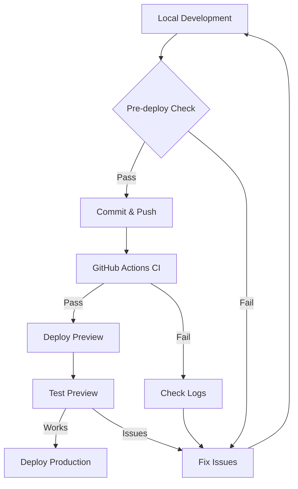

# Deployment Guide - Preventing Trial-and-Error Deployments

## 🚀 Quick Start - New Deployment Workflow

### Before ANY Deployment:

```bash
# 1. Pull latest environment variables
npm run vercel:env:pull

# 2. Run pre-deployment checks
npm run pre-deploy

# 3. If checks fail, debug locally
npm run debug-deploy
```

## 📋 Pre-Deployment Checklist

### 1. Environment Setup
- [ ] Run `npm run validate-env` to check all required environment variables
- [ ] Ensure `.env.local` exists with all required variables
- [ ] Check for any new environment variables in recent commits

### 2. Code Quality Checks
- [ ] Run `npm run type-check` - Must pass with zero errors
- [ ] Run `npm run lint` - Must pass or only have warnings
- [ ] Run `npm run build` locally - Must complete successfully

### 3. Database Migrations
- [ ] Check if any new SQL migrations need to be run
- [ ] Run migrations in Supabase before deploying

## 🛠️ Available Scripts

```bash
# Validation Scripts
npm run pre-deploy      # Run all pre-deployment checks
npm run validate-env    # Validate environment variables
npm run type-check      # Check TypeScript errors
npm run lint            # Check linting errors
npm run debug-deploy    # Debug deployment issues

# Build Scripts
npm run build          # Standard build
npm run build:fast     # Build with more memory
npm run build:analyze  # Analyze bundle size

# Deployment Scripts
npm run vercel:preview  # Deploy preview
npm run vercel:deploy   # Deploy to production
```

## 🔍 Common Issues & Solutions

### 1. TypeScript Errors
```bash
# See all TypeScript errors
npm run type-check

# Common fixes:
# - Missing return types: Add explicit return types
# - Type mismatches: Check API response types
# - Import errors: Ensure all imports exist
```

### 2. Environment Variable Issues
```bash
# Check what's missing
npm run validate-env

# Pull from Vercel
npm run vercel:env:pull

# Common issues:
# - TWILIO_WHATSAPP_FROM must include "whatsapp:" prefix
# - STRIPE keys must start with correct prefixes
# - URLs must be valid (include https://)
```

### 3. Build Memory Issues
```bash
# Use fast build with more memory
npm run build:fast

# Or set manually
NODE_OPTIONS='--max-old-space-size=8192' npm run build
```

### 4. Module Not Found Errors
```bash
# Clean install
npm run clean:all

# Check for case sensitivity issues (common on Vercel)
# Vercel is case-sensitive, your Mac might not be
```

## 📊 Deployment Flow



## 🚨 Emergency Debugging

If deployment fails on Vercel:

1. **Check Vercel Build Logs**
   ```bash
   # In Vercel Dashboard → Project → Functions → Logs
   # Or use CLI
   vercel logs --output build
   ```

2. **Run Debug Script**
   ```bash
   npm run debug-deploy
   # This creates: build.log, typescript.log, dependencies.log
   ```

3. **Check for Large Files**
   ```bash
   # Vercel has file size limits
   find . -type f -size +50M -not -path "./node_modules/*"
   ```

4. **Verify Case Sensitivity**
   ```bash
   # Common issue: importing 'Component' vs 'component'
   # Check all imports match exact file names
   ```

## 🎯 Best Practices

1. **Always Test Locally First**
   - Run `npm run build` before pushing
   - Test with production environment variables

2. **Use Preview Deployments**
   - Push to a feature branch first
   - Test on preview URL before merging to main

3. **Monitor Build Times**
   - If builds take >10 minutes, optimize
   - Use `npm run build:analyze` to find large bundles

4. **Keep Dependencies Updated**
   - Run `npm outdated` regularly
   - Update in small batches, test each

## 📝 Setting Up GitHub Actions

To enable automatic checks on every push:

1. Go to GitHub repo → Settings → Secrets
2. Add these secrets:
   - `VERCEL_TOKEN` - Get from Vercel account settings
   - `VERCEL_ORG_ID` - Get from `.vercel/project.json`
   - `VERCEL_PROJECT_ID` - Get from `.vercel/project.json`
   - `NEXT_PUBLIC_SUPABASE_URL` - Your Supabase URL
   - `NEXT_PUBLIC_SUPABASE_ANON_KEY` - Your Supabase anon key
   - `SUPABASE_SERVICE_ROLE_KEY` - Your Supabase service key

## 🔄 Recommended Development Flow

1. **Feature Development**
   ```bash
   git checkout -b feature/your-feature
   # Make changes
   npm run pre-deploy  # Before committing
   git add .
   git commit -m "feat: your feature"
   git push origin feature/your-feature
   ```

2. **Create Pull Request**
   - GitHub Actions will run tests automatically
   - Preview deployment will be created

3. **After PR Approval**
   ```bash
   git checkout main
   git pull origin main
   git merge feature/your-feature
   git push origin main
   # Auto-deploys to production
   ```

## 📞 Getting Help

If you're stuck:
1. Run `npm run debug-deploy` and check the log files
2. Check Vercel dashboard for detailed error messages
3. Search for the exact error message in the codebase
4. Check if it's a known Next.js 15 issue

Remember: **Most deployment errors can be caught locally!** Always run `npm run pre-deploy` before pushing.