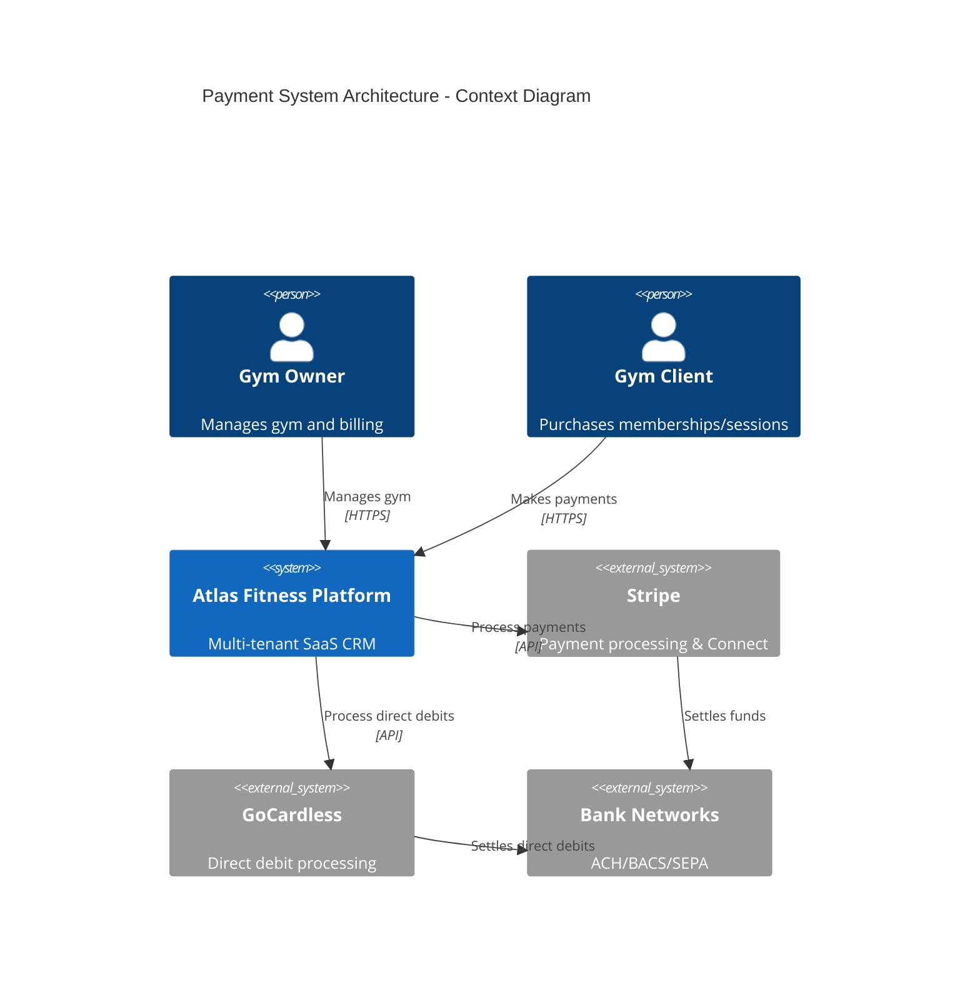
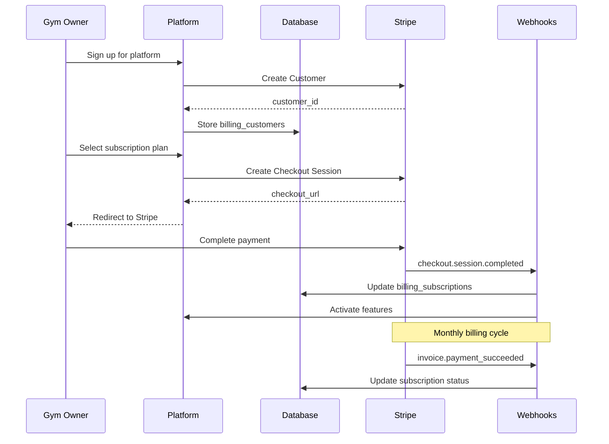
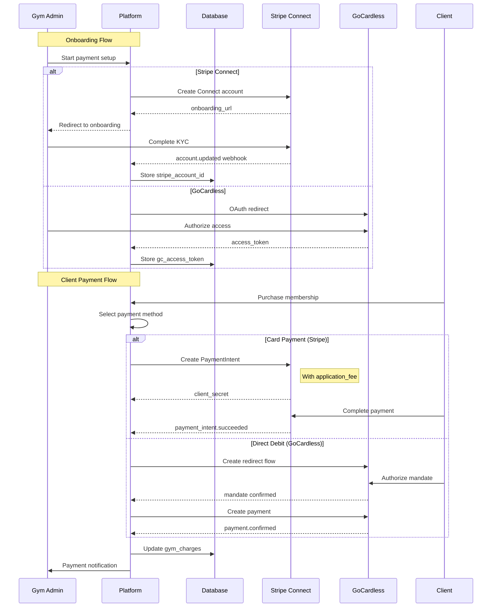
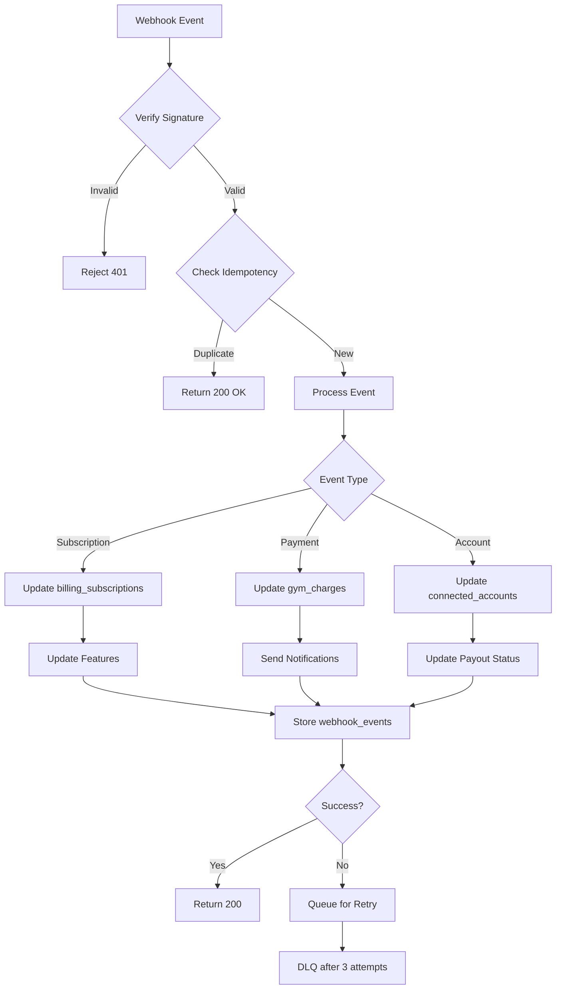

# Payment Architecture - Atlas Fitness Platform

## Overview
Two-rail payment architecture supporting both SaaS billing (platform charges gym owners) and merchant processing (gyms charge their clients).

## Architecture Diagram



## Rail A: SaaS Billing (Platform → Gym Owners)



### SaaS Products & Pricing

| Plan | Monthly | Annual | Features |
|------|---------|--------|----------|
| Starter | £49 | £490 | 100 clients, basic features |
| Pro | £99 | £990 | 500 clients, all features |
| Enterprise | £249 | £2490 | Unlimited, white-label |

## Rail B: Merchant Processing (Gym → Clients)



## Database Schema

```sql
-- Core payment tables structure
┌─────────────────────────┐
│   billing_customers     │
├─────────────────────────┤
│ organization_id (FK)    │
│ stripe_customer_id      │
└─────────────────────────┘
           │
           ├──────────────┐
           ▼              ▼
┌─────────────────────────┐  ┌─────────────────────────┐
│  billing_subscriptions  │  │   connected_accounts    │
├─────────────────────────┤  ├─────────────────────────┤
│ organization_id (FK)    │  │ organization_id (FK)    │
│ stripe_subscription_id  │  │ stripe_account_id       │
│ status                  │  │ gc_access_token         │
│ plan_key               │  │ gc_organization_id      │
└─────────────────────────┘  └─────────────────────────┘
                                        │
                                        ▼
                              ┌─────────────────────────┐
                              │     gym_products        │
                              ├─────────────────────────┤
                              │ organization_id (FK)    │
                              │ name, price_cents       │
                              │ processor (stripe/gc)   │
                              └─────────────────────────┘
                                        │
                                        ▼
                              ┌─────────────────────────┐
                              │      gym_charges        │
                              ├─────────────────────────┤
                              │ organization_id (FK)    │
                              │ product_id (FK)         │
                              │ processor_payment_id    │
                              │ status, amount_cents    │
                              └─────────────────────────┘
```

## Webhook Event Processing



## Security & Compliance

### Payment Data Flow
```
Client Browser → Stripe Elements/GC Redirect → Token → Our Backend → Processor API
                 (PCI compliant iframe)      (Never store raw card data)
```

### Multi-tenant Isolation
- All queries scoped by organization_id
- RLS policies enforce tenant boundaries
- Separate Stripe Connect accounts per org
- Separate GoCardless access tokens per org

## Platform Fees

### Stripe Connect
```javascript
// Application fee on connected payments
const paymentIntent = await stripe.paymentIntents.create({
  amount: 10000, // £100.00
  application_fee_amount: 300, // £3.00 platform fee (3%)
  transfer_data: {
    destination: connectedAccountId,
  },
}, {
  stripeAccount: connectedAccountId,
});
```

### GoCardless Partner Fees
- Negotiated partner agreement
- Or invoice gyms monthly for platform usage

## Environment Variables

```env
# Platform Stripe (our account)
STRIPE_SECRET_KEY=sk_live_xxx
NEXT_PUBLIC_STRIPE_PUBLISHABLE_KEY=pk_live_xxx
STRIPE_WEBHOOK_SECRET=whsec_xxx

# Stripe Connect
STRIPE_CONNECT_CLIENT_ID=ca_xxx
STRIPE_CONNECT_WEBHOOK_SECRET=whsec_xxx

# GoCardless
GOCARDLESS_ENVIRONMENT=live
GOCARDLESS_ACCESS_TOKEN=live_xxx
GOCARDLESS_CLIENT_ID=xxx
GOCARDLESS_CLIENT_SECRET=xxx
GOCARDLESS_REDIRECT_URI=https://app.atlasfitness.com/api/billing/gocardless/callback
GOCARDLESS_WEBHOOK_SECRET=xxx

# Platform Settings
PLATFORM_FEE_BPS=300  # 3% = 300 basis points
```

## API Endpoints Structure

### SaaS Billing (Rail A)
- `POST /api/saas/checkout` - Create subscription checkout
- `GET /api/saas/portal` - Customer portal for payment methods
- `POST /api/webhooks/stripe` - Handle subscription events

### Merchant Onboarding (Rail B)
- `GET /api/connect/stripe/onboard` - Start Stripe Connect
- `GET /api/connect/stripe/refresh` - Refresh onboarding link
- `GET /api/connect/gocardless` - Start GC OAuth
- `GET /api/connect/gocardless/callback` - OAuth callback

### Merchant Processing
- `POST /api/gym/checkout/stripe` - Create card payment
- `POST /api/gym/checkout/gocardless` - Create direct debit
- `GET /api/gym/products` - List gym's products
- `POST /api/gym/products` - Create product/pricing

### Webhooks
- `POST /api/webhooks/stripe` - Stripe events
- `POST /api/webhooks/gocardless` - GoCardless events

## Rollout Plan

### Phase 1: Foundation (Week 1)
- Database migrations
- Environment setup
- Basic webhook handlers

### Phase 2: SaaS Billing (Week 2)
- Stripe Customer creation
- Subscription checkout
- Customer portal

### Phase 3: Merchant Onboarding (Week 3)
- Stripe Connect flow
- GoCardless OAuth
- Account status UI

### Phase 4: Payment Processing (Week 4)
- Product catalog
- Payment flows
- Platform fees

### Phase 5: Polish & Testing (Week 5)
- Error handling
- Observability
- E2E testing
- Documentation

## Success Metrics
- Subscription conversion rate > 60%
- Payment success rate > 95%
- Webhook processing < 500ms p95
- Zero cross-tenant data leaks
- PCI compliance maintained